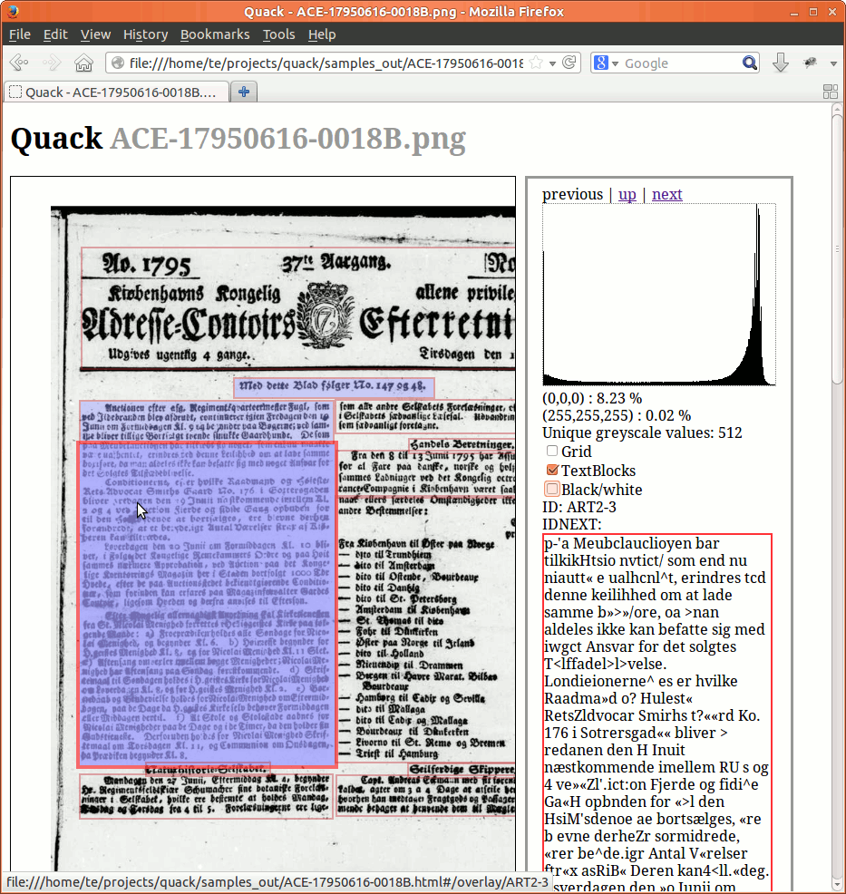

# Quack

An enhanced [ALTO](http://www.loc.gov/standards/alto/)-viewer for Quality Assurance oriented display of a collections of scans, typically from books or newspapers.

## Features

 * Smooth zoom & pan of large images thanks to OpenSeadragon
 * Marking of blown highlights & lowlights by colored overlays (toggleable)
 * TextBlock marking by boxes (toggleable)
 * Interactive inspection of OCR (hover the mouse over a TextBlock)
 * Grid lines for checking skewing and rotation (toggleable)
 * Folder overview with thumbnails
 * Histogram, optionally not analyzing the edges of the image

## Requirements

 * A minimum of 2GB free RAM for processing of 30MP scans
 * bash
 * [GraphicsMagic](http://www.graphicsmagick.org/)
 * [ImageMagick](http://www.imagemagick.org) (as GraphicsMagic cannot create histograms)
 * [openseadragon.min.js](http://openseadragon.github.io/)
 * A suitable beefy browser equipped machine for display, depending on image sizes and ALTO complexity
 * [deepzoom](http://search.cpan.org/~drrho/Graphics-DZI-0.05/script/deepzoom) (only if tile based display is enabled)
  * Perl (required by deepzoom)

## Verbiage

This is basically a simple bash script that grew to 600+ lines. It works on a collection of images with corresponding ALTO-files with OCR and segmentation markup. It creates a HTML page for each image and uses the relevant parts of the ALTO files for creating TextBlock overlays with OCR inspection. No webserver is required as the pages can be used directly from the file system.

It can be quite heavy for the browser to display large images with OpenSeadragon,  when there is a lot of ALTO-derived overlays. This is especially true if tiling is not used. Display has been tested with Firefox & Chrome. Chrome was markedly faster as of 2013-09-17.

## Development

Developed primarily by Toke Eskildsen; partly as a personal project, partly as an employee at the State and University Library, Denmark.
